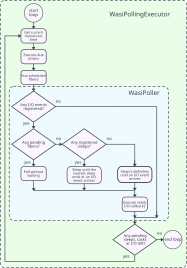

# General information

Student: Mariusz Jakoniuk

Organization: [Typelevel](https://typelevel.org)

Project: <https://summerofcode.withgoogle.com/programs/2026/projects/vibpm0UF>

Git repository: <https://github.com/jarmuszz/wasmports>

# Introduction

WASI is a new set of platform APIs for the WebAssembly platform which give
applications access to runtime-independent I/O abstractions. Because WASI/Wasm
is specification-first, applications targeting this architecture are expected
to be less susceptible to software erosion.

The goal of my project was to prototype ports of Cats Effect and FS2 which
could be later evolved into a stable implementation. Both libraries are reliant
on platform APIs and will not run on WASI without appropriate changes.

# Work Done
https://github.com/user-attachments/assets/a9da121f-d98b-402f-b9c1-9afbbf2ea13f

## Cats Effect

Direct link to fork: <https://github.com/jarmuszz/cats-effect-wasm>

Porting Cats Effect involved creating a new `ExecutionContext` and
`PollingSystem` which could be used to schedule I/O operations using API
exported by `wasi:io/poll`. As planned, the resulting implementation ended up
looking very similar to the one used for Scala Native in Cats Effect `<=3.6.x`.
The `WasiPollingExecutor` essentially implements a `libuv`-style event-loop:

{#Event loop}

New ExecutionContext has been extensively tested by the FS2 port. The public
polling API is not considered stable and will most likely change. Moreover,
WASI port of CE sometimes suffers from [performance
issues](https://github.com/jarmuszz/cats-effect-wasm/issues/3) (specifically on
`wasmtime`) which are most likely limited to the `testkit`.

## FS2

Direct link to fork: <https://github.com/jarmuszz/fs2-wasm>

Because FS2 depends on Cats Effect, work on it had to be started after an
initial PoC of Cats Effect port was completed. So called \"core\" FS2 didn\'t
require much modifications to run, although hashing and compression remain
unimplemented as of now. Most of the time spent on FS2 port was actually used
to get parts of `fs2.io` to run on the new CE execution context and sandboxed
WASI APIs. Even though porting `fs2.io` turned out more challenging than
expected, I managed to port the whole `fs2.io.file` (without parts not allowed
by the WASI sandboxing) and most of `fs2.io.net` TCP socket code.

### fs2.io.file

WASI filesystem methods are sandboxed and can\'t refer to absolute paths.
Runtimes explicitly provide directories that can be used by components (called
\"preopens\") and applications can only resolve filesystem objects relative to
them.

My implementation treats preopens as top-level paths. That is, directories
provided by `wasmtime run --dir=foo --dir=bar ...` can be accessed by
`Path("/foo")` and `Path("/bar")`. Moreover, because WASIp2 does not have a
concept of a working directory, paths are resolved as if CWD was set to `/`.

Methods referring to the `TEMP` directory are being forwarded to the preopen
named \"tmp\". Also, POSIX permissions and `userHome` are not available because
they are not exposed by sandbox.

For the time being, JDK NIO-like file API is provided by the
[`wasi4s`](https://github.com/jarmuszz/wasi4s) library which currently also
exposes bindings to WASI used by Cats Effect and FS2. There are plans to
release WASI bindings under the `scala-wasm` or `scala-js` organization after
things stabilize. The filesystem API will most likely be revised and moved into
a separate package.

### fs2.io.net

Work on sockets was started as the last in the project as a couple of network
unit tests rely on filesystem to be available. Only TCP sockets have been
implemented (as of time of writing this report) with the plan to implement UDP
later. WASIp2 also does not expose access to UNIX sockets so they had to be
skipped for this API version.

Implementation does not yet expose any `SocketOptions` but providing those
should be trivial.

# What did I learn?

Over the course of the project I significantly improved my knowledge about the
Scala ecosystem. I often reached to the internals of `scala-wasm` and followed
its development closely. My focus was centered not only on the ported libraries
but also on how the new platform integrates with the tooling.

I feel that I have gained a lot of insight into the inner workings of Cats
Effect and FS2. Even though I have used those libraries before, up until now,
they seemed like a black box to me. Besides the Typelevel stack, I also had to
get familiar with and port other libraries (mainly `munit` and `ip4s`).

I have always wanted to dig into WebAssembly and this project has proven to be
my first insight into this platform. Aside from `scala-wasm`, I have read a lot
of code from `TinyGo` and `Rust` and compared their implementations of WASI.

# Future work

Even though this year\'s GSoC is over, I am planning to continue working with
Typelevel projects and eventually stabilize my PoC implementation. I will
finish `fs2.io.net` and bring continuous integration to WASI builds. I am also
going to adapt my code to the new WIT APIs that have landed in `scala-wasm` in
the last few days.
